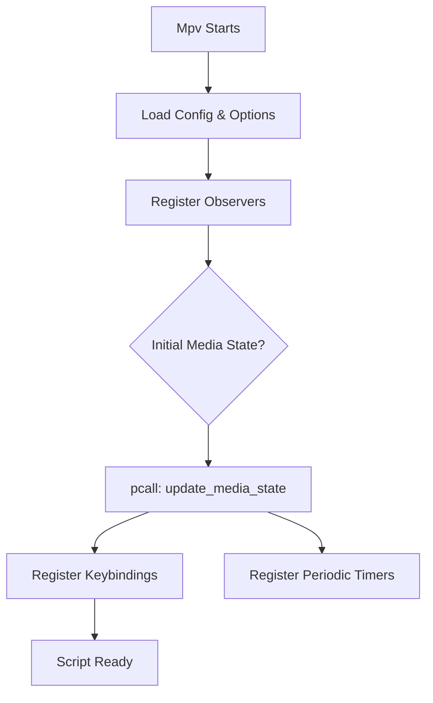

# Design: Robust Startup and State Recovery

## Architecture Changes

### 1. The Global Startup Guard
We will modify the startup sequence to ensure that all synchronous data loading is decoupled from keybinding registration.



By wrapping `update_media_state` in a `pcall`, we guarantee that a failure in reading a malformed TSV or a Windows path encoding error doesn't halt the rest of the script.

### 2. State Sync in `load_anki_tsv`
The logic will be updated to handle the "File Missing" state as a valid "Zero Highlights" state, rather than an early exit.

- **Current (Baseline)**: If `io.open` fails, return `nil`. `ANKI_HIGHLIGHTS` stays as it was.
- **New**: If `io.open` fails, `ANKI_HIGHLIGHTS = {}`.

### 3. Dynamic Header Detection
Instead of hardcoding `"WordSource"` and `"Term"`, we will lookup the actual field name configured for the `source_word` mapping in `anki_mapping.ini`. This prevents the header row from being treated as a content row when the column names are customized (e.g., "Quotation").

### 4. Drum Window Empty-State Guard
We will add an explicit check to `cmd_toggle_drum_window`:
```lua
if #Tracks.pri.subs == 0 then
    show_osd("Drum Window: No subtitles loaded")
    return
end
```
This solves the "blank screen" issue by preventing the window from ever opening in an invalid state.
