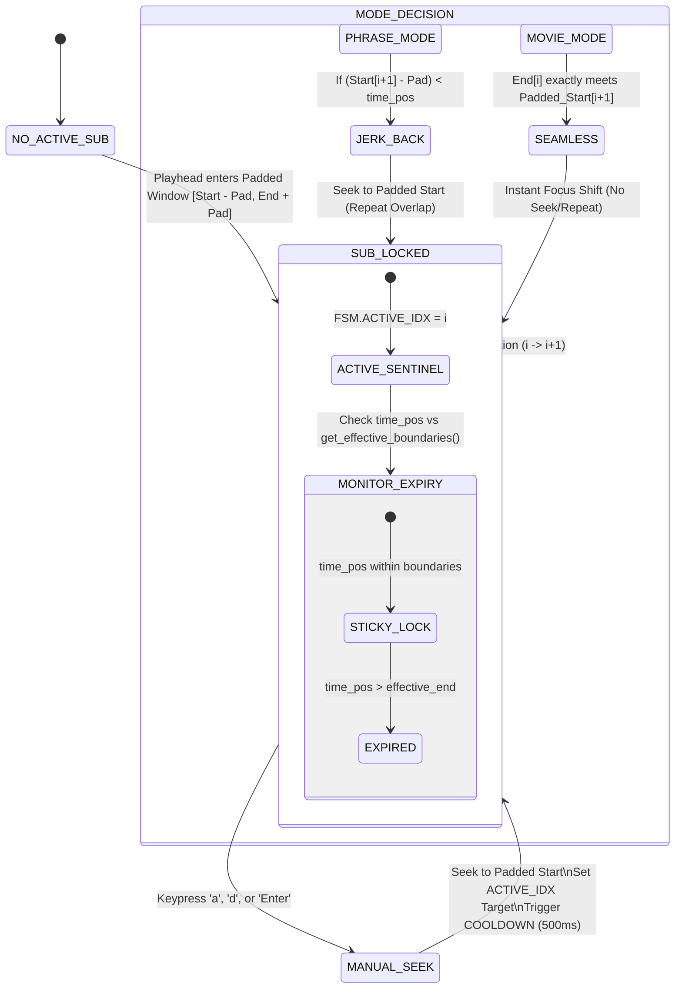

# Design: Immersion Suite Hardening

## Context
The Kardenwort immersion engine manages real-time subtitle synchronization and navigation. With the introduction of pre-roll/post-roll padding, the temporal boundaries of subtitles became ambiguous, leading to "Magnetic Snapping" where the player would fight the user's manual navigation or skip audio tails. We are transitioning to a deterministic State Machine (FSM) to resolve these conflicts.

## Goals / Non-Goals

**Goals:**
- Implement a **Deterministic Sentinel** (`FSM.ACTIVE_IDX`) that locks focus to a subtitle until its padded end is reached.
- Support **Dual Immersion Modes**:
  - **MOVIE**: Seamless transitions at padded boundaries.
  - **PHRASE**: Isolated cards with overlap-repeats (Jerk-Back).
- Filter **Secondary Subtitle Cycling** to exclude unsupported internal tracks.
- Parameterize all behavioral thresholds (`nav_cooldown`, `nav_tolerance`, `autopause_overshoot`).

**Non-Goals:**
- Creating a release bundle (already explicitly requested to be removed).
- Implementing new mining/capture features.

## Decisions

### 1. The Sentinel-Led FSM
Instead of calculating the "closest" subtitle every tick (which leads to erratic snapping in padded overlaps), we use `FSM.ACTIVE_IDX` as the source of truth.
- **Sticky Focus**: Once a subtitle is active, it stays active until the playhead exits its `[Start-Pad, End+Pad]` window.
- **Transition Logic**: When the sentinel expires, we look ahead. If the next subtitle's padded start has already begun, we switch immediately (Scientific Overlap Priority).

### 2. "Jerk-Back" Architecture (Phrases Mode)
To ensure 100% audio context for sentence mining, the engine detects "Natural" transitions. If Subtitle `i+1` starts before Subtitle `i` ends (padded), the engine performs a one-shot seek (Jerk-Back) to `i+1`'s padded start.
- **Visual Shield**: The `FSM.JUST_JERKED_TO` flag prevents the sentinel from snapping back to the previous line during the overlap.

### 3. State Transition Diagram

### 4. Filtered Track Selection
The `Shift+c` handler now performs an explicit filter of the `track-list`.
- **Constraint**: Only `external` tracks are included in the cycle.
- **UI**: If internal tracks are present but hidden, the OSD displays `[N built-in hidden]` to inform the user why they are skipped.

## Risks / Trade-offs

- **Floating Point Error**: Extremely small overlaps (e.g., 1ms) could trigger erratic behavior. 
  - **Mitigation**: Introduced `nav_tolerance` (Default: 50ms) to ignore micro-gaps.
- **Manual Seek Fighting**: Smart logic might fight manual seeks.
  - **Mitigation**: Introduced `nav_cooldown` (Default: 500ms) settle period.
