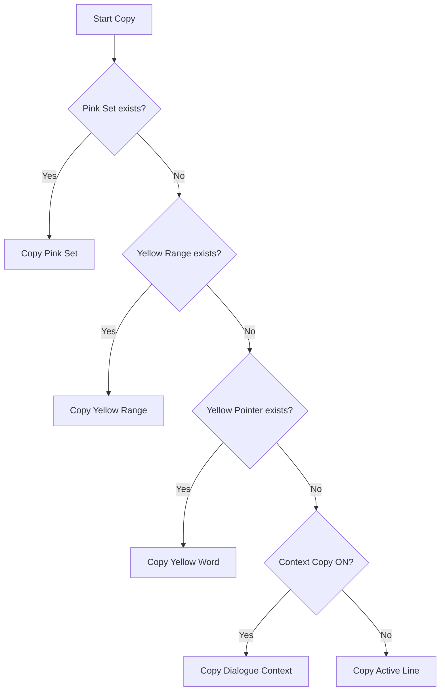

# Design: Prioritized Selection in Context Copy

## Architecture
The logic resides in `get_clipboard_text_smart`, which is used by both `cmd_dw_copy` (Drum Window) and `cmd_copy_sub` (Regular Mode).

### Priority Hierarchy

### Esc Regulation
The `Esc` key (`cmd_dw_esc`) already operates in stages:
- **Stage 1**: Clears Pink Set.
- **Stage 2**: Clears Yellow Range.
- **Stage 3**: Clears Yellow Pointer.
- **Stage 4**: Closes Window.

This change ensures that `get_clipboard_text_smart` respects these stages by checking them in the same order of specificity.

## Implementation Details
- **Pink Set Collection**: Iterate through `FSM.DW_CTRL_PENDING_SET`, sort by line and word index, and pass to `prepare_export_text` with `type = "SET"`.
- **Yellow Selection**: Use `get_dw_selection_bounds()` and `FSM.DW_CURSOR_WORD`.
- **Context Harvesting**: Use `get_copy_context_text()`.
