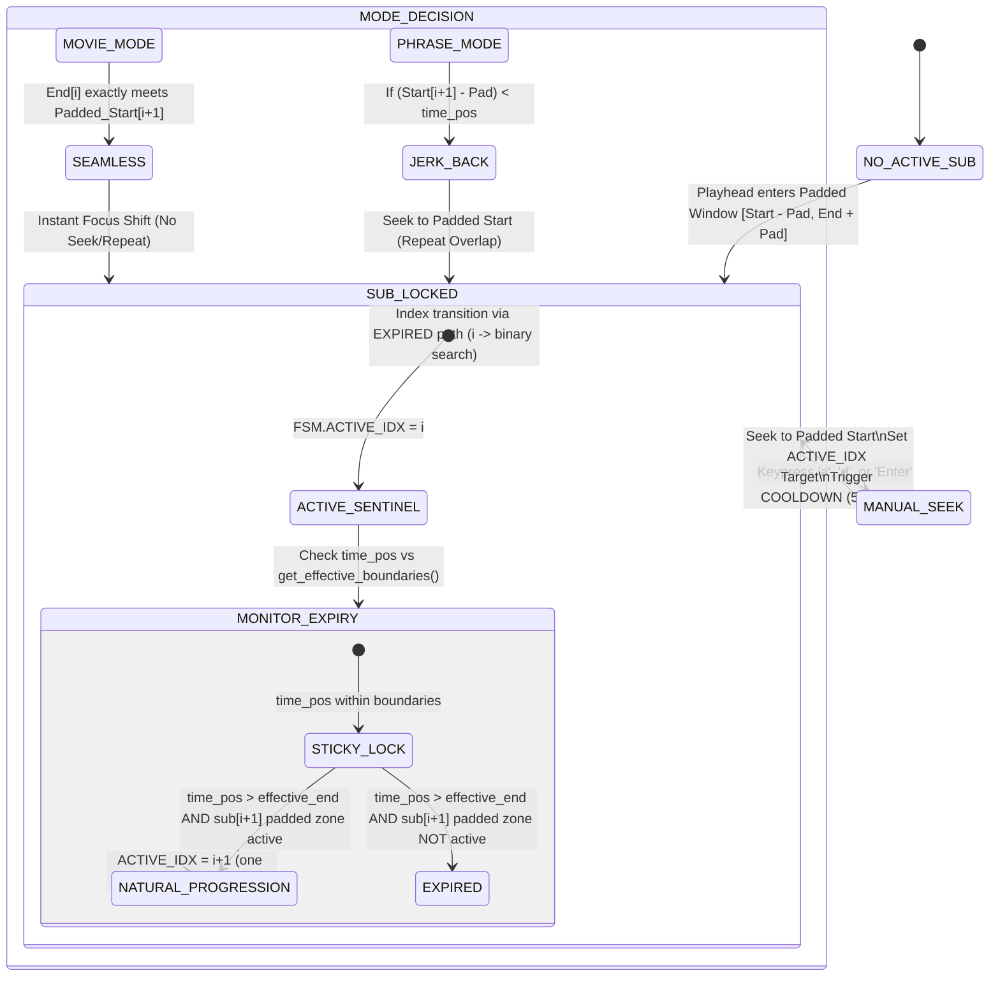

# Design: Natural Progression Sub-Skip Fix

## Context

The immersion FSM uses `get_center_index` to determine which subtitle is "active" at any given playhead position. It applies three checks in order:

1. **Sticky Sentinel**: If `ACTIVE_IDX` is set and `time_pos` is within its effective boundaries, return `ACTIVE_IDX` (no transition).
2. **Binary Search + Overlap Priority**: Find the latest sub whose `start_time ≤ time_pos`. Then check if `best+1`'s padded start has already begun — if so, promote to `best+1`.
3. **Fallback**: Return `best`.

The bug manifests at step 2. With `audio_padding_start=1000ms`, when the sticky sentinel for sub `i` expires, the Overlap Priority check finds that `(i+2)`'s padded start has already begun, promoting `best` to `best+1 = i+2`, completely skipping sub `i+1`.

## Fix: One-step Natural Progression

Insert a new check **between steps 1 and 2** that enforces the spec's `i → i+1` transition rule:

```
After sticky sentinel check (ACTIVE_IDX still set but expired):
  → Check if ACTIVE_IDX+1's padded zone contains time_pos
  → If YES: return ACTIVE_IDX+1  (Natural Progression, one step)
  → If NO: fall through to binary search
```

This guarantees that when focus transitions away from sub `i`, it always lands on sub `i+1` first — regardless of how many subsequent subs have padded zones overlapping `time_pos`.

### Implementation (lls_core.lua, `get_center_index`)

```lua
-- [v1.58.53] One-step Natural Progression (per immersion-engine spec).
-- When focus on sub `i` expires and sub `i+1`'s padded zone is active,
-- transition to `i+1` - never skip intermediate subs even when large
-- audio_padding values cause multiple subs' padded zones to overlap time_pos.
if active_idx and active_idx ~= -1 and active_idx + 1 <= #subs and subs[active_idx + 1] then
    local next_idx = active_idx + 1
    local s_next, e_next = get_effective_boundaries(subs[next_idx], next_idx)
    if s_next and e_next and time_pos >= s_next - Options.nav_tolerance and time_pos <= e_next then
        return next_idx
    end
end
```

The `time_pos <= e_next` guard is critical for MOVIE mode: in MOVIE mode, sub `i+1`'s effective end equals sub `i+2`'s padded start (gapless). When `time_pos` advances past that boundary, the condition fails and binary search handles the MOVIE transition correctly.

## Updated FSM State Transition Diagram



**Key addition**: The `NATURAL_PROGRESSION` state is now an explicit named transition between `STICKY_LOCK` and `SUB_LOCKED`. It fires when the sticky expires AND the consecutive next sub's padded zone has already started, guaranteeing one-step progression (`i → i+1`) before the binary search path is used.

## Mode Compatibility

| Mode   | Natural Progression active? | Behavior |
|--------|-----------------------------|----------|
| PHRASE | Yes (when next sub's padded zone overlaps) | Returns `ACTIVE_IDX+1`, jerk-back fires if needed |
| MOVIE  | Conditional (falls through when `time_pos > e_next`) | Binary search + Overlap Priority handles gapless MOVIE handover |

## Why Not Fix Overlap Priority Instead?

Overlap Priority (`best+1`) could be removed entirely. However:
- It handles the case where the playhead jumps into the middle of a padded zone from outside (e.g., file-open, scrub) with no `ACTIVE_IDX` set.
- Natural Progression only fires when `ACTIVE_IDX != -1` (i.e., we know where we came from).
- The two checks are orthogonal: Natural Progression wins during sequential playback; Overlap Priority handles cold-entry cases.
