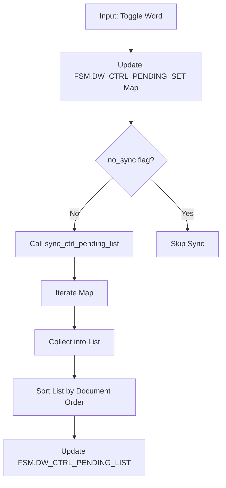

# Design: Simplify Selection Logic via FSM State

## Architecture
The FSM will now explicitly track the sorted state of the Pink Set.

### FSM Extensions
- `FSM.DW_CTRL_PENDING_LIST`: A sorted array of `{line, word}` objects representing the active Pink Set.

### Synchronized Update Flow


### Batch Optimization
For operations that modify many words at once (e.g., `cmd_dw_toggle_pink`), `ctrl_toggle_word` is called with a `no_sync` flag to prevent redundant sorting and OSD updates. A single synchronization is performed after the batch is complete.

### Simplified Copy Priority
```lua
function get_clipboard_text_smart()
    -- 1. Pink Set (Pre-sorted in FSM)
    if #FSM.DW_CTRL_PENDING_LIST > 0 then
        return prepare_export_text({type="SET", members=FSM.DW_CTRL_PENDING_LIST}, ...)
    end
    
    -- 2. Yellow Selection
    -- ... (Range / Pointer)
    
    -- 3. Context / Fallback
    -- ...
end
```

## Implementation Details
- **Sync Trigger**: `sync_ctrl_pending_list` is called at the end of `ctrl_toggle_word` and any function that clears the set.
- **Redundancy Removal**: `ctrl_commit_set` is refactored to use `FSM.DW_CTRL_PENDING_LIST` directly.
