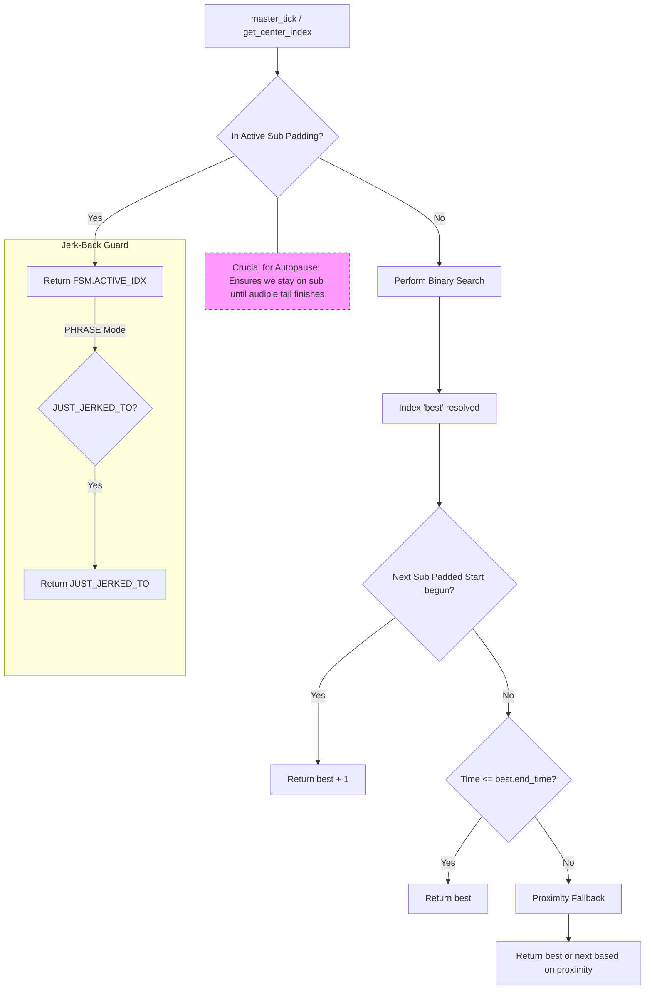

## 12. Index Resolution & Padding (Deterministic Sentinel)
Defines the hierarchical logic for mapping the current `time_pos` to a subtitle index, ensuring audible tail protection and preventing Jerk-Back loops.

