# FSM State Architecture Specification
**ZID: 20260506112010**

This document specifies the Finite State Machine (FSM) architecture for the Kardenwort immersion engine. It serves as the "Source of Truth" for the AI agent to verify codebase consistency and behavior.

## 1. Global UI Rendering FSM (Mutual Exclusion)
The system ensures that only one primary rendering engine is active at a time to prevent overlay flickering and coordinate conflicts.

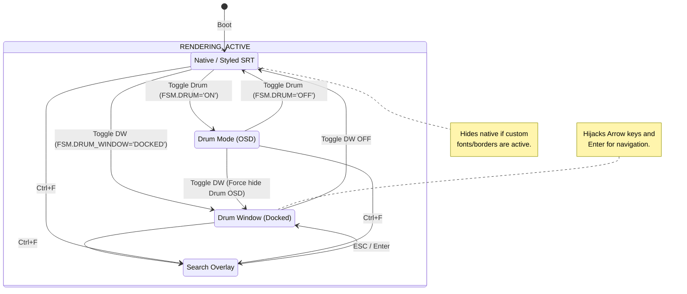
```mermaid
stateDiagram-v2
    [*] --> NATIVE_SRT: Boot
    
    state "Native / Styled SRT" as NATIVE_SRT
    state "Drum Mode (OSD)" as DRUM_MODE
    state "Drum Window (Docked)" as DRUM_WINDOW
    state "Search Overlay" as SEARCH_MODE

    NATIVE_SRT --> DRUM_MODE : Toggle Drum (FSM.DRUM='ON')
    DRUM_MODE --> NATIVE_SRT : Toggle Drum (FSM.DRUM='OFF')
    
    NATIVE_SRT --> DRUM_WINDOW : Toggle DW (FSM.DRUM_WINDOW='DOCKED')
    DRUM_MODE --> DRUM_WINDOW : Toggle DW (Force hide Drum OSD)
    
    DRUM_WINDOW --> NATIVE_SRT : Toggle DW OFF
    
    state RENDERING_ACTIVE {
        DRUM_WINDOW --> SEARCH_MODE : Ctrl+F
        SEARCH_MODE --> DRUM_WINDOW : ESC / Enter
        
        NATIVE_SRT --> SEARCH_MODE : Ctrl+F
        DRUM_MODE --> SEARCH_MODE : Ctrl+F
    }
    
    note right of NATIVE_SRT
        Hides native if custom 
        fonts/borders are active.
    end note
    
    note left of DRUM_WINDOW
        Hijacks Arrow keys and 
        Enter for navigation.
    end note
```

## 2. Immersion Mode FSM (Playback Behavior)
Controls how the playhead interacts with subtitle boundaries.

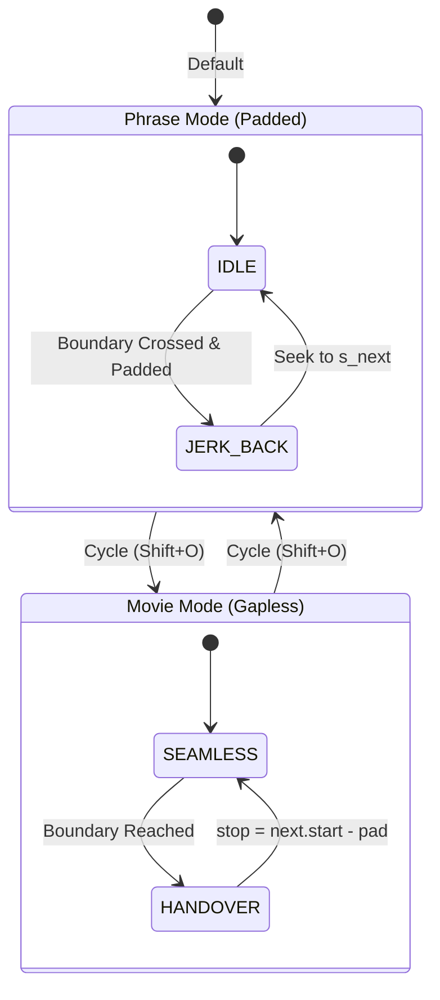
```mermaid
stateDiagram-v2
    [*] --> PHRASE_MODE : Default
    
    state "Phrase Mode (Padded)" as PHRASE_MODE
    state "Movie Mode (Gapless)" as MOVIE_MODE
    
    PHRASE_MODE --> MOVIE_MODE : Cycle (Shift+O)
    MOVIE_MODE --> PHRASE_MODE : Cycle (Shift+O)
    
    state PHRASE_MODE {
        [*] --> IDLE
        IDLE --> JERK_BACK : Boundary Crossed & Padded
        JERK_BACK --> IDLE : Seek to s_next
    }
    
    state MOVIE_MODE {
        [*] --> SEAMLESS
        SEAMLESS --> HANDOVER : Boundary Reached
        HANDOVER --> SEAMLESS : stop = next.start - pad
    }
```

## 3. Autopause & Spacebar Lifecycle
Manages the "Sticky Hold" and automated halt behavior.

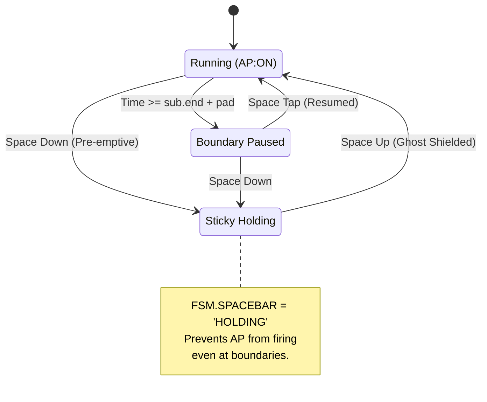
```mermaid
stateDiagram-v2
    [*] --> AP_RUNNING
    
    state "Running (AP:ON)" as AP_RUNNING
    state "Boundary Paused" as AP_PAUSED
    state "Sticky Holding" as AP_HOLDING
    
    AP_RUNNING --> AP_PAUSED : Time >= sub.end + pad
    AP_PAUSED --> AP_RUNNING : Space Tap (Resumed)
    
    AP_RUNNING --> AP_HOLDING : Space Down (Pre-emptive)
    AP_PAUSED --> AP_HOLDING : Space Down
    
    AP_HOLDING --> AP_RUNNING : Space Up (Ghost Shielded)
    
    note right of AP_HOLDING
        FSM.SPACEBAR = 'HOLDING'
        Prevents AP from firing
        even at boundaries.
    end note
```

## 4. Selection & Esc Stages (The "Color Tiers")
Specifies the priority of selection types and how `Esc` peels back layers.

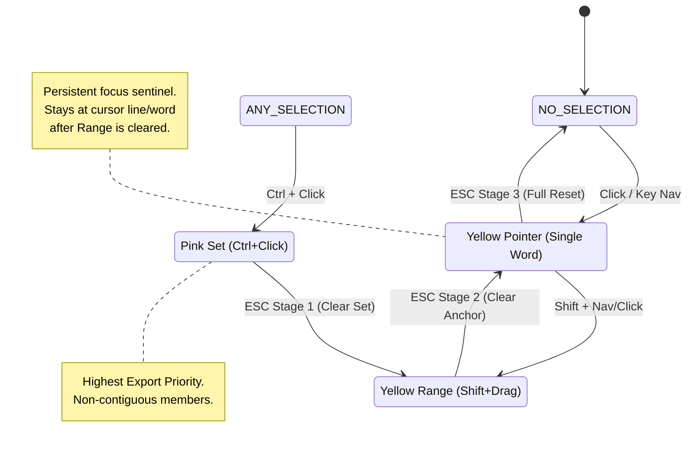
```mermaid
stateDiagram-v2
    [*] --> NO_SELECTION
    
    state "Yellow Pointer (Single Word)" as POINTER
    state "Yellow Range (Shift+Drag)" as RANGE
    state "Pink Set (Ctrl+Click)" as PINK_SET
    
    NO_SELECTION --> POINTER : Click / Key Nav
    POINTER --> RANGE : Shift + Nav/Click
    
    ANY_SELECTION --> PINK_SET : Ctrl + Click
    
    PINK_SET --> RANGE : ESC Stage 1 (Clear Set)
    RANGE --> POINTER : ESC Stage 2 (Clear Anchor)
    POINTER --> NO_SELECTION : ESC Stage 3 (Full Reset)
    
    note right of PINK_SET
        Highest Export Priority.
        Non-contiguous members.
    end note

    note left of POINTER
        Persistent focus sentinel.
        Stays at cursor line/word
        after Range is cleared.
    end note
```

## 5. Tooltip Lifecycle (Translation Overlay)
Controls visibility and positioning of the translation tooltip.

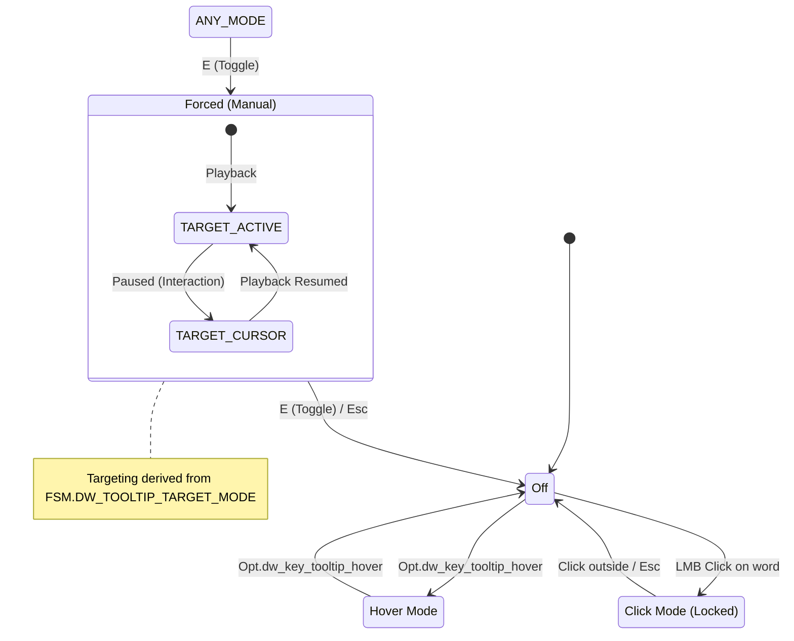
```mermaid
stateDiagram-v2
    [*] --> MODE_OFF
    
    state "Off" as MODE_OFF
    state "Hover Mode" as MODE_HOVER
    state "Click Mode (Locked)" as MODE_CLICK
    state "Forced (Manual)" as MODE_FORCE
    
    MODE_OFF --> MODE_HOVER : Opt.dw_key_tooltip_hover
    MODE_HOVER --> MODE_OFF : Opt.dw_key_tooltip_hover
    
    MODE_OFF --> MODE_CLICK : LMB Click on word
    MODE_CLICK --> MODE_OFF : Click outside / Esc
    
    ANY_MODE --> MODE_FORCE : E (Toggle)
    MODE_FORCE --> MODE_OFF : E (Toggle) / Esc
    
    state MODE_FORCE {
        [*] --> TARGET_ACTIVE : Playback
        TARGET_ACTIVE --> TARGET_CURSOR : Paused (Interaction)
        TARGET_CURSOR --> TARGET_ACTIVE : Playback Resumed
    }
    
    note right of MODE_FORCE
        Targeting derived from 
        FSM.DW_TOOLTIP_TARGET_MODE
    end note
```

## 6. Copy & Clipboard Priority
Defines the "Source of Truth" for the `cmd_copy_sub` command.

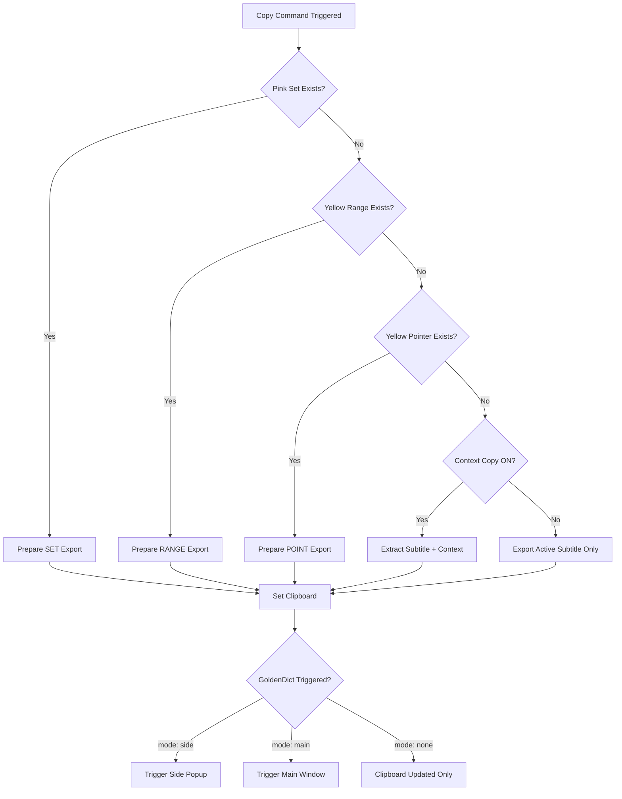
```mermaid
graph TD
    Start[Copy Command Triggered] --> Pink{Pink Set Exists?}
    Pink -- Yes --> ExportPink[Prepare SET Export]
    Pink -- No --> Range{Yellow Range Exists?}
    Range -- Yes --> ExportRange[Prepare RANGE Export]
    Range -- No --> Pointer{Yellow Pointer Exists?}
    Pointer -- Yes --> ExportPointer[Prepare POINT Export]
    Pointer -- No --> Context{Context Copy ON?}
    Context -- Yes --> ExportContext[Extract Subtitle + Context]
    Context -- No --> Fallback[Export Active Subtitle Only]
    
    ExportPink --> SetClip[Set Clipboard]
    ExportRange --> SetClip
    ExportPointer --> SetClip
    ExportContext --> SetClip
    Fallback --> SetClip
    
    SetClip --> GDT{GoldenDict Triggered?}
    GDT -- "mode: side" --> SideGD[Trigger Side Popup]
    GDT -- "mode: main" --> MainGD[Trigger Main Window]
    GDT -- "mode: none" --> Finish[Clipboard Updated Only]
```

## 7. Viewport & Scroll Logic
Controls how the text window follows playback or manual interaction.

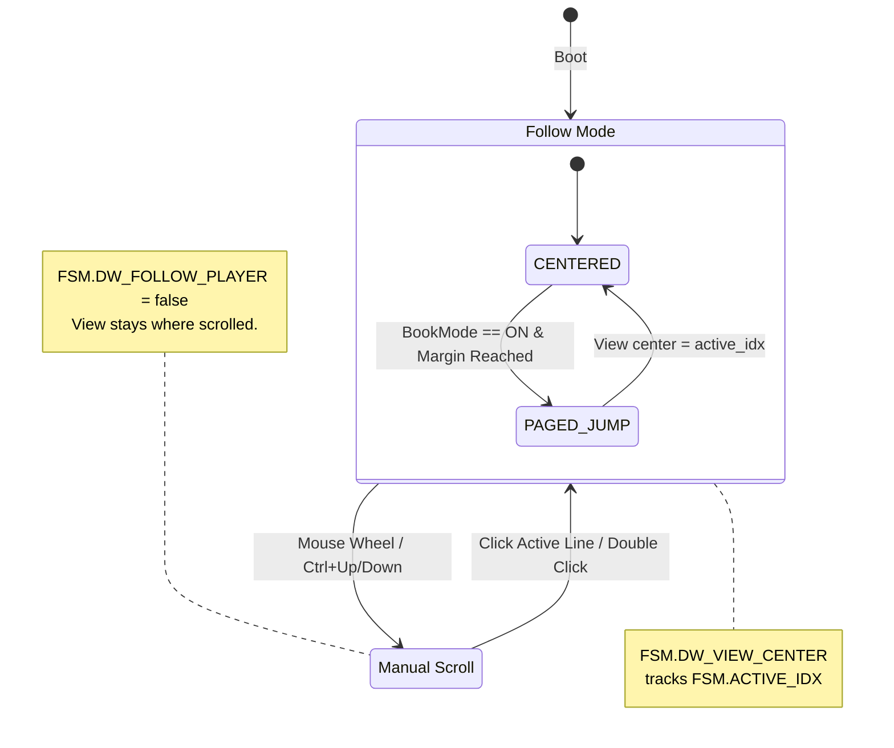
```mermaid
stateDiagram-v2
    [*] --> FOLLOW_PLAYER : Boot
    
    state "Follow Mode" as FOLLOW_PLAYER
    state "Manual Scroll" as MANUAL_SCROLL
    
    FOLLOW_PLAYER --> MANUAL_SCROLL : Mouse Wheel / Ctrl+Up/Down
    MANUAL_SCROLL --> FOLLOW_PLAYER : Click Active Line / Double Click
    
    state FOLLOW_PLAYER {
        [*] --> CENTERED
        CENTERED --> PAGED_JUMP : BookMode == ON & Margin Reached
        PAGED_JUMP --> CENTERED : View center = active_idx
    }
    
    note right of FOLLOW_PLAYER
        FSM.DW_VIEW_CENTER 
        tracks FSM.ACTIVE_IDX
    end note
    
    note left of MANUAL_SCROLL
        FSM.DW_FOLLOW_PLAYER = false
        View stays where scrolled.
    end note
```

## 8. Adaptive Subtitle Replay & Looping
Manages persistent loops and one-shot replays with ghosting protection.

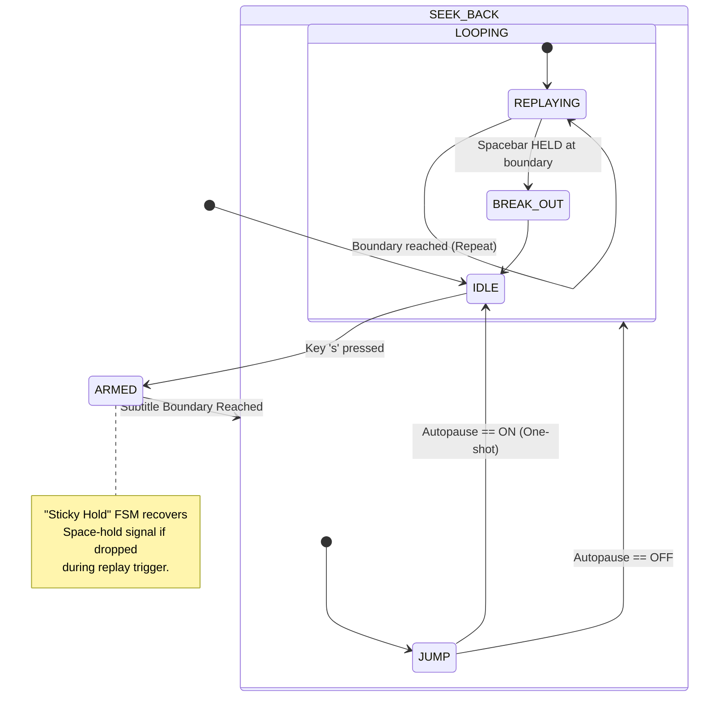
```mermaid
stateDiagram-v2
    [*] --> IDLE
    
    IDLE --> ARMED : Key 's' pressed
    ARMED --> SEEK_BACK : Subtitle Boundary Reached
    
    state SEEK_BACK {
        [*] --> JUMP
        JUMP --> LOOPING : Autopause == OFF
        JUMP --> IDLE : Autopause == ON (One-shot)
    }
    
    state LOOPING {
        [*] --> REPLAYING
        REPLAYING --> REPLAYING : Boundary reached (Repeat)
        REPLAYING --> BREAK_OUT : Spacebar HELD at boundary
        BREAK_OUT --> IDLE
    }
    
    note right of ARMED
        "Sticky Hold" FSM recovers
        Space-hold signal if dropped
        during replay trigger.
    end note
```

## 9. Search HUD & Hit-Zone Lifecycle
Manages the global search overlay with dynamic wrapping and hit-testing.

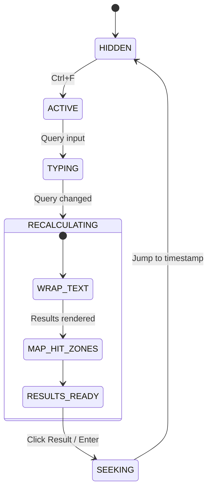
```mermaid
stateDiagram-v2
    [*] --> HIDDEN
    
    HIDDEN --> ACTIVE : Ctrl+F
    ACTIVE --> TYPING : Query input
    TYPING --> RECALCULATING : Query changed
    
    state RECALCULATING {
        [*] --> WRAP_TEXT
        WRAP_TEXT --> MAP_HIT_ZONES : Results rendered
        MAP_HIT_ZONES --> RESULTS_READY
    }
    
    RESULTS_READY --> SEEKING : Click Result / Enter
    SEEKING --> HIDDEN : Jump to timestamp
```

## 10. Sticky Column Navigation (VSCode Style)
Maintains horizontal alignment during vertical navigation.

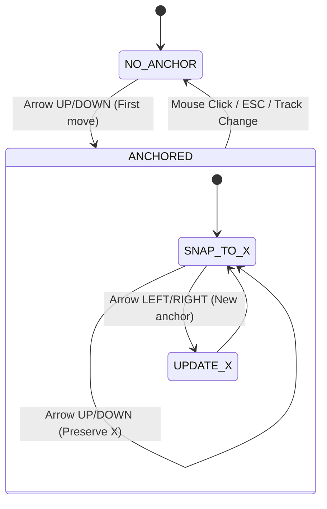
```mermaid
stateDiagram-v2
    [*] --> NO_ANCHOR
    
    NO_ANCHOR --> ANCHORED : Arrow UP/DOWN (First move)
    
    state ANCHORED {
        [*] --> SNAP_TO_X
        SNAP_TO_X --> SNAP_TO_X : Arrow UP/DOWN (Preserve X)
        SNAP_TO_X --> UPDATE_X : Arrow LEFT/RIGHT (New anchor)
        UPDATE_X --> SNAP_TO_X
    }
    
    ANCHORED --> NO_ANCHOR : Mouse Click / ESC / Track Change
```

## 11. Anki Sync & Fingerprinting
Ensures in-memory highlights stay synced with the physical database.

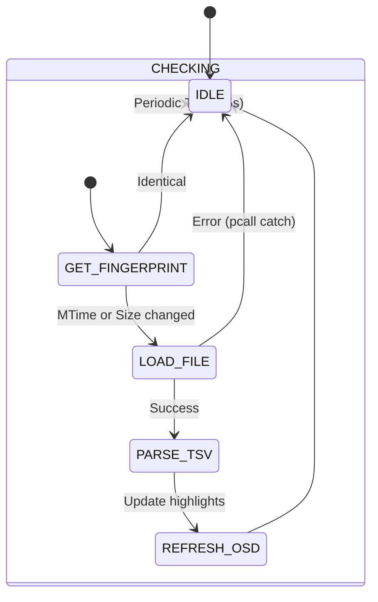
```mermaid
stateDiagram-v2
    [*] --> IDLE
    
    IDLE --> CHECKING : Periodic Timer (5s)
    
    state CHECKING {
        [*] --> GET_FINGERPRINT
        GET_FINGERPRINT --> LOAD_FILE : MTime or Size changed
        GET_FINGERPRINT --> IDLE : Identical
        LOAD_FILE --> PARSE_TSV : Success
        LOAD_FILE --> IDLE : Error (pcall catch)
        PARSE_TSV --> REFRESH_OSD : Update highlights
        REFRESH_OSD --> IDLE
    }
```

## 12. Highlight Nesting Resolution
Priority logic for rendering overlapping saved terms.

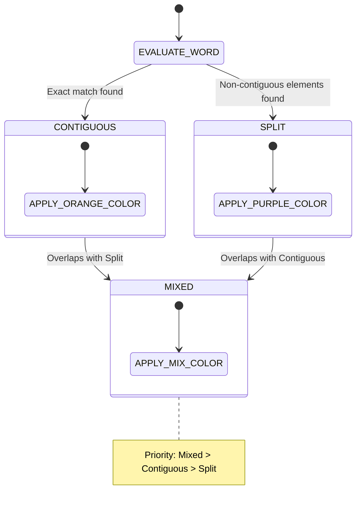
```mermaid
stateDiagram-v2
    [*] --> EVALUATE_WORD
    
    EVALUATE_WORD --> CONTIGUOUS : Exact match found
    EVALUATE_WORD --> SPLIT : Non-contiguous elements found
    
    CONTIGUOUS --> MIXED : Overlaps with Split
    SPLIT --> MIXED : Overlaps with Contiguous
    
    state MIXED {
        [*] --> APPLY_MIX_COLOR
    }
    
    state CONTIGUOUS {
        [*] --> APPLY_ORANGE_COLOR
    }
    
    state SPLIT {
        [*] --> APPLY_PURPLE_COLOR
    }
    
    note right of MIXED
        Priority: Mixed > Contiguous > Split
    end note
```

## 13. Native Visibility Suppression Hierarchy
Controls how custom overlays "fight" native mpv subtitles in `master_tick`.

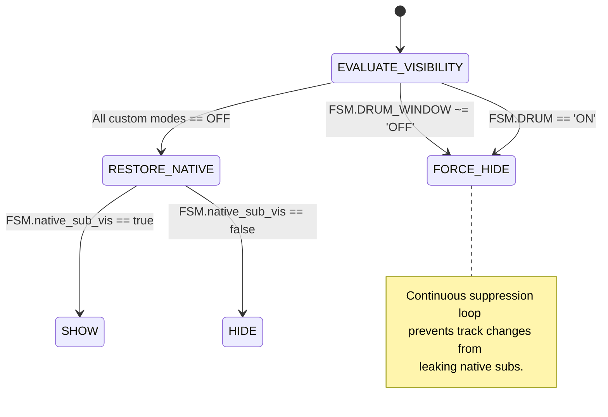
```mermaid
stateDiagram-v2
    [*] --> EVALUATE_VISIBILITY
    
    EVALUATE_VISIBILITY --> FORCE_HIDE : FSM.DRUM_WINDOW ~= 'OFF'
    EVALUATE_VISIBILITY --> FORCE_HIDE : FSM.DRUM == 'ON'
    
    EVALUATE_VISIBILITY --> RESTORE_NATIVE : All custom modes == OFF
    
    RESTORE_NATIVE --> SHOW : FSM.native_sub_vis == true
    RESTORE_NATIVE --> HIDE : FSM.native_sub_vis == false
    
    note right of FORCE_HIDE
        Continuous suppression loop 
        prevents track changes from 
        leaking native subs.
    end note
```

## 14. Interaction Shielding (Jitter Protection)
Defeats hardware-level ghost clicks and jitter.

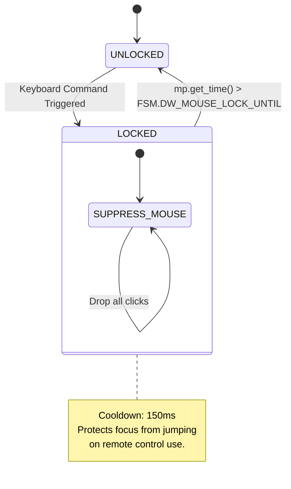
```mermaid
stateDiagram-v2
    [*] --> UNLOCKED
    
    UNLOCKED --> LOCKED : Keyboard Command Triggered
    LOCKED --> UNLOCKED : mp.get_time() > FSM.DW_MOUSE_LOCK_UNTIL
    
    state LOCKED {
        [*] --> SUPPRESS_MOUSE
        SUPPRESS_MOUSE --> SUPPRESS_MOUSE : Drop all clicks
    }
    
    note right of LOCKED
        Cooldown: 150ms
        Protects focus from jumping
        on remote control use.
    end note
```

## 15. Token Logical Indexing Model
Specifies how tokens are addressed for range selection and export.

| TOKEN_TYPE | Logical Index (L_IDX) | Navigation Stop | Rationale |
| :--- | :--- | :--- | :--- |
| **Word** | Integer (1, 2, 3...) | Yes | Primary vocab hub |
| **Symbol/Tag** | Fractional (1.1, 1.2...) | Yes | Surgical precision |
| **Line Break** | Fractional (1.9, 2.9...) | No | Layout marker |
| **Whitespace** | Fractional (0.5, 1.5...) | No | Ignored by arrows |

## 16. Rendering Color Priority Hierarchy
Determines visual color when multiple states overlap on a single token.

| PRIORITY | LAYER | COLOR_KEY | SOURCE |
| :--- | :--- | :--- | :--- |
| **1 (Highest)** | Persistent Set | Pink | `FSM.DW_CTRL_PENDING_SET` |
| **2** | Manual Focus | Gold | `FSM.DW_CURSOR_LINE/WORD` |
| **3** | Database (Mixed) | Brick | Contiguous + Split overlap |
| **4** | Database (Contig) | Orange | Anki Contiguous Match |
| **5** | Database (Split) | Purple | Anki Non-Contiguous Match |
| **6 (Lowest)** | Default | White/Gray | `FSM.ACTIVE_IDX` context |

## 17. Export Joiner Logic (Smart Splicing)
Controls how selections are reconstructed into text for Anki/Clipboard.

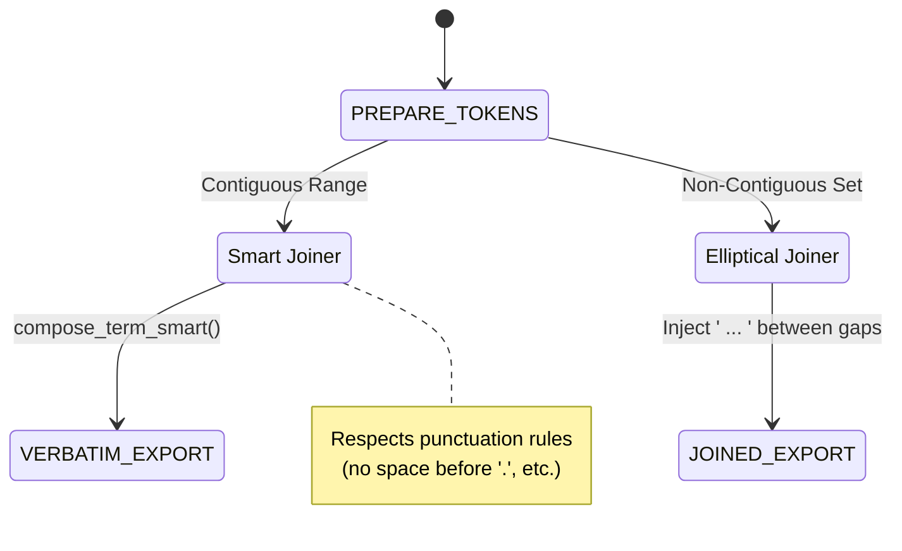
```mermaid
stateDiagram-v2
    [*] --> PREPARE_TOKENS
    
    state "Smart Joiner" as SMART_JOINER
    state "Elliptical Joiner" as ELLIPSIS
    
    PREPARE_TOKENS --> SMART_JOINER : Contiguous Range
    PREPARE_TOKENS --> ELLIPSIS : Non-Contiguous Set
    
    SMART_JOINER --> VERBATIM_EXPORT : compose_term_smart()
    ELLIPSIS --> JOINED_EXPORT : Inject ' ... ' between gaps
    
    note right of SMART_JOINER
        Respects punctuation rules 
        (no space before '.', etc.)
    end note
```

## 18. Surgical vs Full Highlighting
Visual behavior based on selection type.

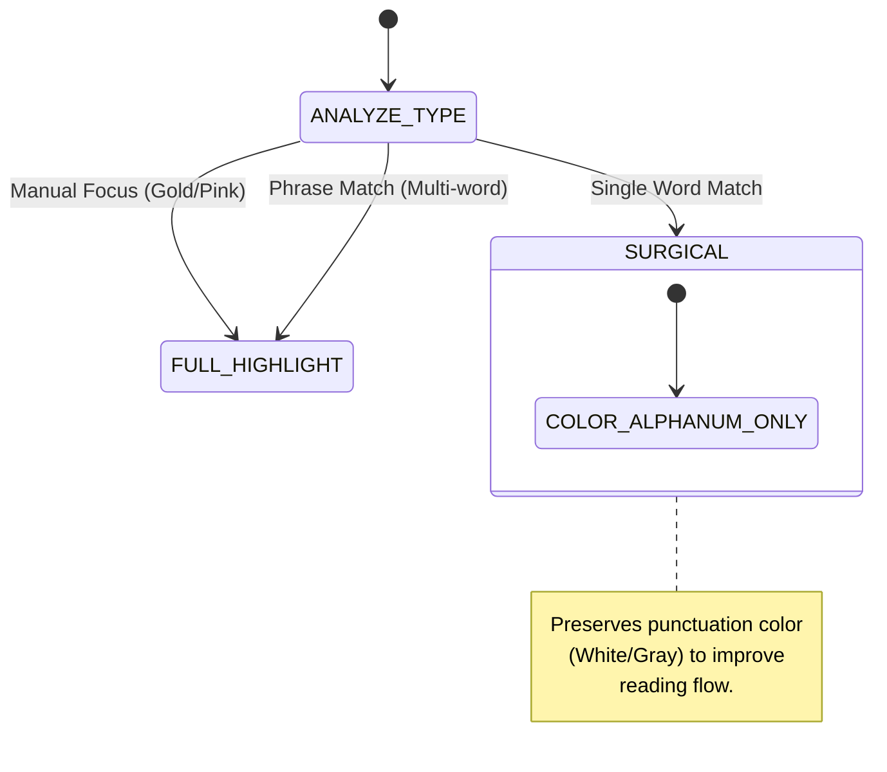
```mermaid
stateDiagram-v2
    [*] --> ANALYZE_TYPE
    
    ANALYZE_TYPE --> FULL_HIGHLIGHT : Manual Focus (Gold/Pink)
    ANALYZE_TYPE --> FULL_HIGHLIGHT : Phrase Match (Multi-word)
    ANALYZE_TYPE --> SURGICAL : Single Word Match
    
    state SURGICAL {
        [*] --> COLOR_ALPHANUM_ONLY
    }
    
    note right of SURGICAL
        Preserves punctuation color 
        (White/Gray) to improve 
        reading flow.
    end note
```

---
**Verification Schema:**
1. `FSM.DRUM_WINDOW == 'DOCKED'` MUST suppress `native-sub-visibility`.
2. `FSM.IMMERSION_MODE == 'PHRASE'` MUST trigger `mp.commandv("seek", s_next, "absolute+exact")` when `time-pos` crosses into padded overlap.
3. `FSM.SPACEBAR == 'HOLDING'` MUST bypass `tick_autopause`.
4. `FSM.SEARCH_MODE == true` MUST hijack all character input keys.
5. `cmd_dw_esc` MUST clear selection tiers in order: Pink -> Range -> Pointer.
6. `cmd_dw_scroll` MUST set `FSM.DW_FOLLOW_PLAYER = false`.
7. `load_anki_tsv` MUST use `pcall` and fingerprinting to avoid redundant parsing or crashes.
8. `Middle-Click` (Export) MUST trigger `dw_reset_selection()` upon successful record commitment.
9. `Sticky Column` anchor MUST reset if `FSM.DW_CURSOR_LINE` is manually changed via mouse.
10. `is_word_char` MUST NOT return true for brackets `[]` or slashes `/`.
11. Mouse events MUST return early if `mp.get_time() < FSM.DW_MOUSE_LOCK_UNTIL`.
12. `get_sub_tokens` MUST assign fractional indices to non-word characters to ensure Word-Integer alignment.
