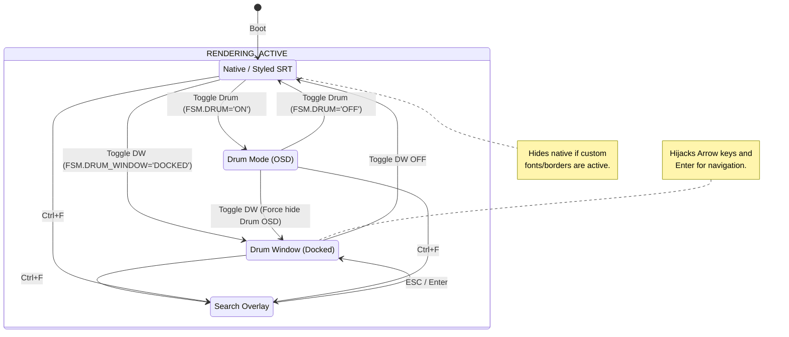
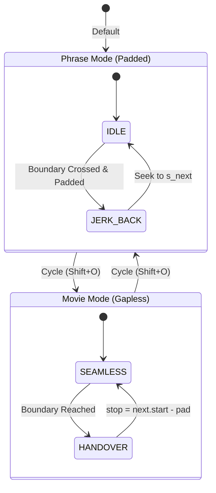
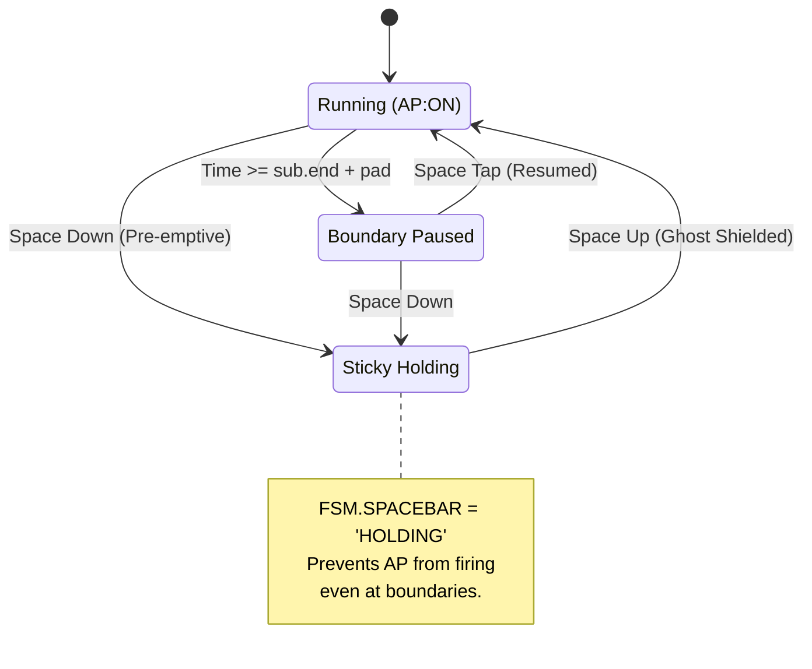
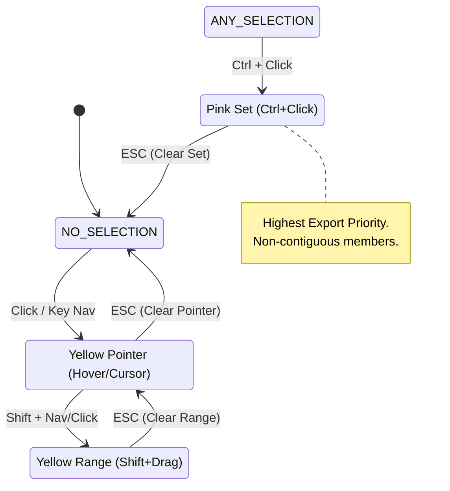

# FSM State Architecture Specification
**ZID: 20260506104409**

This document specifies the Finite State Machine (FSM) architecture for the Kardenwort immersion engine. It serves as the "Source of Truth" for the AI agent to verify codebase consistency and behavior.

## 1. Global UI Rendering FSM (Mutual Exclusion)
The system ensures that only one primary rendering engine is active at a time to prevent overlay flickering and coordinate conflicts.

## 2. Immersion Mode FSM (Playback Behavior)
Controls how the playhead interacts with subtitle boundaries.

## 3. Autopause & Spacebar Lifecycle
Manages the "Sticky Hold" and automated halt behavior.

## 4. Selection & Interactivity FSM (The "Color Tiers")
Specifies the priority of selection types for copy operations.

## 5. Media State Matrix (Codec/Track Detection)
Determines capability availability based on loaded media.

| MEDIA_STATE | Capability: Autopause | Capability: Drum/DW | Capability: Search |
| :--- | :--- | :--- | :--- |
| `NO_SUBS` | Disabled | Blocked | Blocked |
| `SINGLE_SRT` | Full | Full | Full |
| `SINGLE_ASS` | Full | Blocked (Native Only) | Full (External Only) |
| `DUAL_SRT` | Synced | Dual-Track View | Combined |
| `DUAL_ASS` | Synced | Blocked (Native Only) | Combined |

---
**Verification Schema:**
1. `FSM.DRUM_WINDOW == 'DOCKED'` MUST suppress `native-sub-visibility`.
2. `FSM.IMMERSION_MODE == 'PHRASE'` MUST trigger `mp.commandv("seek", s_next, "absolute+exact")` when `time-pos` crosses into padded overlap.
3. `FSM.SPACEBAR == 'HOLDING'` MUST bypass `tick_autopause`.
4. `FSM.SEARCH_MODE == true` MUST hijack all character input keys.
