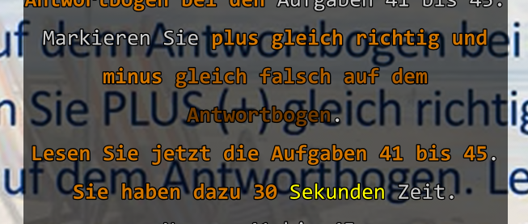
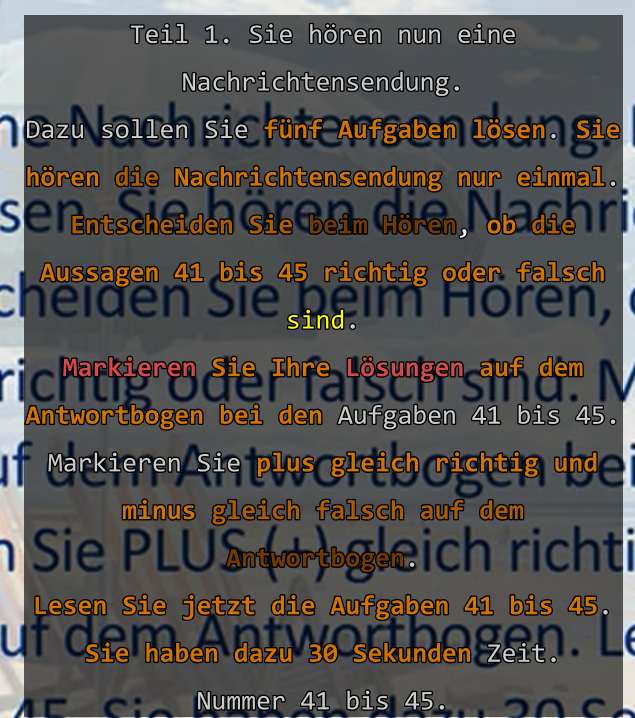

# window-highlighting-spec

## Purpose
This specification provides a formal, exhaustive description of word highlighting behaviors within the "Window Mode" (Drum Window). It serves as a strict directive for the rendering engine to ensure consistent visual feedback. This document focuses on the expected behavioral and visual output, independent of specific technical implementation or parsing architecture.
## Requirements
### Requirement: Tri-Palette System
The rendering engine SHALL utilize three distinct color palettes, each with three levels of depth (intensity), to indicate match complexity.

#### Scenario: Palette Assignment
- **WHEN** the engine identifies a database match
- **THEN** it SHALL assign Orange for contiguous, Purple for split, or Brick for intersection according to the match type.

- **Palette 1: Contiguous (Orange)**: Used for exact word sequence matches found in the user's database.
- **Palette 2: Split (Purple)**: Used for multi-word terms where constituent words are present in the same context but arranged non-contiguously.
- **Palette 3: Brick Color (Intersection)**: Used when a single word is simultaneously a member of at least one Contiguous term and at least one Split term.

### Requirement: Palette Precedence and Priority Logic
The highlighting engine MUST evaluate potential matches in a specific order to ensure that the most natural reading (contiguous phrases) is prioritized.

#### Scenario: Contiguous Priority for Nearby Words
- **GIVEN** a saved term contains multiple words.
- **WHEN** those words appear in a subtitle segment as an exact, adjacent sequence.
- **THEN** the engine SHALL render them using the **Orange** palette rather than Purple.
- **AND** this priority applies regardless of how the term was originally selected or saved.

### Requirement: Interaction and Selection Priority
Manual user selections SHALL always carry higher visual priority than automated database highlights.

- **Primary Priority**: Multi-word persistent selections (e.g., Ctrl + LMB). Rendered in **Pale Yellow**.
- **Secondary Priority**: Transient cursor-based hover / focus range. Rendered in **Vibrant Yellow**.
- **Tertiary Priority**: Vocabulary database highlights (Orange/Purple/Brick Color).

#### Scenario: Selection vs. Hover
- **GIVEN** a word is currently part of a persistent multi-word selection (Pale Yellow).
- **WHEN** the user hovers the cursor over that word.
- **THEN** the word SHALL remain Pale Yellow.

#### Scenario: Selection vs. Automated Highlight
- **GIVEN** a word is a saved vocabulary term (e.g., Orange).
- **WHEN** the user includes it in a manual persistent selection.
- **THEN** the selection color (Pale Yellow) SHALL override the automated highlight.

#### Scenario: Focus Overwhelming Database Highlight
- **GIVEN** a word is rendered in the Orange or Purple palette due to a database match.
- **WHEN** the user hovers the cursor over that word (Transient Focus).
- **THEN** the word SHALL immediately transition to **Vibrant Yellow**.
- **AND** the automated highlight SHALL be restored when the cursor moves away.

#### Scenario: Selection Range Overwhelming Database Highlight
- **GIVEN** a range of words includes automated Orange highlights.
- **WHEN** the user defines a selection range (LMB Drag) covering those words.
- **THEN** all words within the range SHALL transition to **Vibrant Yellow**.
- **AND** the automated highlights SHALL be unmasked only when the selection range is cleared or moved.

### Requirement: Depth Calculation and Intensity
The intensity level for any color SHALL be determined by the cumulative number of unique overlapping matches assigned to that specific word.

#### Scenario: Determining pure palette level
- **WHEN** a word is matched by 2 separate Contiguous terms and 0 Split terms.
- **THEN** it SHALL be rendered using the second intensity level of the Orange palette.

#### Scenario: Determining brick palette level
- **WHEN** a word is matched by $O$ Contiguous terms AND $S$ Split terms (where $O > 0$ and $S > 0$).
- **THEN** the base level of intersection (1 Contiguous + 1 Split) SHALL be rendered as **Intensity Level 1** of the Brick Color palette.
- **AND** the total intensity $L$ for higher-order overlaps SHALL be calculated as $L = \text{clamp}(O + S - 1, 1, 3)$.

#### Scenario: Complex Combination (Brick Nesting)
- **WHEN** a word is simultaneously part of 1 contiguous term and 2 split terms.
- **THEN** the engine SHALL apply the Brick Color palette at intensity level 3.

### Requirement: Semantic Punctuation Coloring
Highlighting SHALL include trailing or internal punctuation only when it is part of a multi-word phrase.

#### Scenario: Single-word isolation
- **GIVEN** a word is only matched as a single-word term (e.g., "word.").
- **THEN** trailing punctuation (the dot) SHALL NOT be highlighted.

#### Scenario: Phrase continuity
- **GIVEN** a word is part of a multi-word phrase match (e.g., "the word.").
- **THEN** all internal and trailing punctuation within that phrase span SHALL be highlighted.

### Requirement: High-Recall Sequence Verification
To prevent false-positive highlights of common words, the engine MUST verify the local context of every match in Global Mode.

#### Scenario: Neighborhood check
- **WHEN** evaluating a match in Global Mode.
- **THEN** the engine MUST verify that at least one neighboring word (within a ±3 word window) matches the original recorded context.
- **AND** symbol-only tokens SHALL be ignored during this verification.

### Requirement: Inter-Segment Continuity
Highlighting SHALL persist across subtitle segment boundaries if strict temporal and sequential constraints are met.

#### Scenario: Bridging segments
- **WHEN** a multi-word term is split between two sequential subtitles.
- **AND** the temporal gap between the segments is ≤ 1.5 seconds.
- **THEN** the engine SHALL highlight the respective parts in both segments.
- **AND** the engine SHALL recursively check up to 5 adjacent segments.

### Requirement: Long-Term Adaptive Fuzzy Window
The temporal validity window for a term SHALL grow dynamically based on term length.

#### Scenario: Long paragraph temporal growth
- **GIVEN** a saved term longer than 10 words.
- **THEN** the base validity window SHALL be extended by **0.5 seconds** for every word beyond the tenth.

### Requirement: Context Search Radius
For split (non-contiguous) terms, the engine SHALL scan a widened cluster of subtitle segments.

#### Scenario: Subtitle segment scan cluster
- **GIVEN** the engine is evaluating a potential split match.
- **THEN** it SHALL scan up to **±15 subtitle segments** (approximately 30 seconds of context) to locate all constituent words.

### Requirement: Strict Context Neighbor Verification
When strict context matching is enabled, matches MUST be anchored by their recorded indices or neighbors.

- **Index Grounding**: If a record contains a `SentenceSourceIndex`, the engine SHALL verify that the word's current logical position exactly matches the recorded index.
- **Neighbor Fallback**: If no index is present (legacy records), the engine SHALL look past up to **4 consecutive symbols/separators** to find the nearest word and verify it against the recorded context.

#### Scenario: Index Matching vs. Bleed
- **GIVEN** a database record has `SentenceSourceIndex: 6` for the word `die`.
- **AND** the current segment has a `die` at index 3 and a `die` at index 6.
- **THEN** the engine SHALL only highlight the `die` at index 6.

#### Scenario: Symbol-Agnostic Neighbor Detection
- **WHEN** searching for neighbors to verify context (for legacy records missing an index).
- **THEN** the engine SHALL look past up to **4 consecutive symbols/separators** to find the nearest word.

### Requirement: Highlighting Exemptions
The engine SHALL exempt specific tokens from strict neighbor verification.

#### Scenario: Exempt Labels
- **GIVEN** a potential match is a bracketed label (e.g., `[musik]`) or a common unit/adjective (e.g., `km`, `kg`, `ca`).
- **THEN** the engine SHALL exempt these from strict neighbor verification.

### Requirement: Split Term Shortest Span
The engine SHALL strictly control which individual word instances are colored when they form part of a split term.

#### Scenario: Minimizing phrase span
- **WHEN** multiple instances of a term's words exist within the scan radius.
- **THEN** the engine SHALL calculate the **shortest sequential span** that contains all words in their original order.
- **AND** only the word instances within that optimal span SHALL be highlighted.

### Requirement: Highlight Rendering Scope (Global vs. Local)
The rendering engine SHALL support two distinct modes of evaluation.

#### Scenario: Mode Availability
- **WHEN** the engine evaluates a record
- **THEN** it SHALL support Local Highlighting (anchored by timestamp) and Global Highlighting (context-verified).

- **Local Highlighting**: Highlights are strictly anchored to the original capture context by matching the record's timestamp.
- **Global Highlighting**: Highlights are applied across the entire timeline, provided they pass strict neighborhood verification.

### Requirement: Interaction, Input, and State Transitions
The Drum Window SHALL respond to mouse and keyboard inputs with deterministic visual feedback and navigation.

#### Scenario: Vibrant Yellow Selection (LMB)
- **WHEN** a user clicks LMB on a word.
- **THEN** it SHALL be highlighted in **Vibrant Yellow** (Current Focus).
- **WHEN** a user clicks and drags LMB.
- **THEN** a contiguous range SHALL be highlighted in Vibrant Yellow.
- **AND** this selection SHALL persist even if the user scrolls the window.
- **AND** the selection SHALL only reset when the user clicks a different word, moving the focus point.

### Requirement: Split-Pair Selection (Ctrl+LMB)
The system SHALL support manual selection of non-contiguous word pairs.

#### Scenario: Split-Pair Selection (Ctrl + LMB)
- **WHEN** a user holds Ctrl and clicks words.
- **THEN** they SHALL be highlighted in **Beige/Pale Yellow** (Split candidates).
- **AND** these selections SHALL carry higher visual priority than automated highlights but lower than the Vibrant Yellow Focus point.
- **AND** if a word already has Vibrant Yellow focus, the Beige color MUST visually overlap/indicator the "paired" state.
- **AND** if the user clicks a Beige word with Ctrl again (Deselection), the engine MUST **unmask and restore** the word's precise underlying state (e.g., reverting to its database color, active white, or drag yellow).
- **AND** if two *adjacent* words are saved via this mode, the engine SHALL automatically transition them to **Orange** palette rendering (Adjacent-Split Fallback).

### Requirement: Export Shortcuts (MMB)
The engine SHALL provide immediate visual feedback during mouse-driven exports.

#### Scenario: Export Shortcuts (MMB)
- **WHEN** a user holds MMB on a word.
- **THEN** the word SHALL immediately turn Vibrant Yellow (Preview Focus).
- **WHEN** the user releases MMB.
- **THEN** the word/selection SHALL be exported to the database and transition to **Orange** (or secondary depth).

### Requirement: Book Mode Navigation
The system SHALL support synchronized media seeking when navigating via Book Mode.

#### Scenario: Book Mode Navigation
- **GIVEN** "Book Mode" is enabled.
- **WHEN** a user jumps to a subtitle (Double-click/Enter).
- **THEN** the media player SHALL seek to that time.
- **AND** the active line SHALL be highlighted in white.
- **BUT** the engine SHALL NOT force the text to re-center vertically on the active line, preserving the user's current scroll position.

### Requirement: Color Intersection and Engulfment Logic
The engine SHALL dynamically determine the final color of a word when it is affected by multiple overlapping term types.

#### Scenario: Intersection Evaluation
- **WHEN** a word is targeted by multiple highlight palettes
- **THEN** the engine SHALL apply the highest priority color or intersection brick as defined by the hierarchy.

#### Scenario: Engulfing (Orange covering Purple)
- **GIVEN** a word is already highlighted as **Purple** (Split match).
- **WHEN** an **Orange** (Contiguous) range is defined that includes this word (Engulfing).
- **THEN** the word SHALL transition to **Brick Color**.
- **AND** its intensity SHALL reflect the total number of overlapping matches (Orange count + Purple count).

#### Scenario: Inter-Palette Depth Increasing
- **WHEN** a word belongs to multiple terms of the same color (e.g., two overlapping Purple terms).
- **THEN** its intensity SHALL increase (deeper purple) to represent the nesting level, up to the third depth level.

### Requirement: Multi-Line Selection and Saving
The system SHALL support selecting and exporting word sequences that span across multiple subtitle segments.

#### Scenario: Multi-segment selection capture
- **WHEN** a user selection starts in one segment and ends in another.
- **THEN** the engine SHALL collect all words in between and join them into a single, space-normalized string for export.

#### Scenario: Timestamp Anchoring
- **WHEN** a multi-line selection is saved.
- **THEN** the record SHALL be anchored to the **start time of the first segment** in the selection.

#### Scenario: Smart Punctuation Restoration
- **WHEN** a multi-word selection starts at a sentence boundary and is capitalized.
- **AND** the original sequence ended with terminal punctuation.
- **THEN** the engine SHALL append a period `.` to the saved term.

### Requirement: ASS Mode Restrictions
Advanced ASS styling SHALL be subject to restrictions to prevent visual corruption.

#### Scenario: Complex Positioning and Draw Commands
- **GIVEN** a segment uses complex positioning (`\pos`) or drawing commands (`\p1`).
- **THEN** automated highlighting SHALL be automatically disabled for that segment.

#### Scenario: Pre-colored ASS text
- **GIVEN** an ASS segment has hardcoded high-level styling (e.g. colors).
- **THEN** the highlighter SHALL prioritize its own palette (Orange/Purple/Brick), overriding original styling where necessary.

### Requirement: Direct Line/Segment Navigation
The Drum Window SHALL allow rapid navigation to any visible subtitle segment using mouse or keyboard input.

#### Scenario: Jump to Segment (Double-Click / Enter)
- **GIVEN** the Drum Window is open and displaying multiple segments.
- **WHEN** a user performs the FIRST click of a double-click on a word.
- **THEN** the word SHALL momentarily turn **Vibrant Yellow** (Focus Indicator).
- **WHEN** the user performs the SECOND click.
- **THEN** the engine SHALL immediately clear any transient Vibrant Yellow highlight.
- **AND** it SHALL set that segment as the "Active" segment (immediately turning the text white).
- **AND** the media player SHALL jump to the start time of the newly activated segment.

### Requirement: Interaction and State Transitions
Rendering of highlights SHALL be independent of mouse activity to ensure immediate visual feedback.

#### Scenario: Immediate Rendering on Open
- **WHEN** the Drum Window (Mode W) is opened.
- **THEN** the engine SHALL immediately calculate and render all database-driven highlights for the currently visible segments.
- **AND** these highlights SHALL be visible before any mouse movement or user collision occurs.

## Reference Visuals

### Requirement: Elliptical Split Matching
The system SHALL support non-contiguous word matching by identifying explicit ellipsis markers in the database term.

#### Scenario: Enforcing Split Match for Elliptical Terms
- **WHEN** the engine encounters a term with the ` ... ` marker.
- **THEN** it SHALL bypass Phase 1 (Contiguous) and Phase 2 (Contextual) evaluations.
- **AND** it SHALL initiate Phase 3 (Split Match) to identify the component words within the scan cluster.

#### Scenario: Multi-Part Split Highlighting
- **GIVEN** a term contains multiple ellipses (e.g., `Entscheiden ... beim ... ob`).
- **WHEN** the highlighter evaluates the term.
- **THEN** it SHALL identify all three components (`Entscheiden`, `beim`, `ob`) across the scan radius.
- **AND** it SHALL highlight all involved words in the **Purple** palette.

#### Scenario: Partial Contiguity within Split Terms
- **GIVEN** a term contains mixed contiguity (e.g., `Aussagen ... richtig oder`).
- **WHEN** the highlighter evaluates the term.
- **THEN** it SHALL treat the entire term as Split-Only due to the presence of ` ... `.
- **AND** it SHALL highlight the single word (`Aussagen`) and the contiguous pair (`richtig`, `oder`) together in the purple palette when found in the same context.

### Highlighting Example (Concrete Case)
- **Source Context**: `Entscheiden Sie beim Hören, ob die Aussagen 41 bis 45 richtig oder falsch sind.`
- **Database Term**: `Aussagen ... richtig oder`
  - **Match Logic**: Skips Orange/Phase 1. Finds `Aussagen`, `richtig`, and `oder` within the 2.0s window.
  - **Visual**: `Aussagen` (Purple), `richtig` (Purple), `oder` (Purple).
- **Database Term**: `Entscheiden ... beim ... ob`
  - **Match Logic**: Skips Orange/Phase 1. Finds `Entscheiden`, `beim`, and `ob` within the 2.0s window.
  - **Visual**: `Entscheiden` (Purple), `beim` (Purple), `ob` (Purple).
